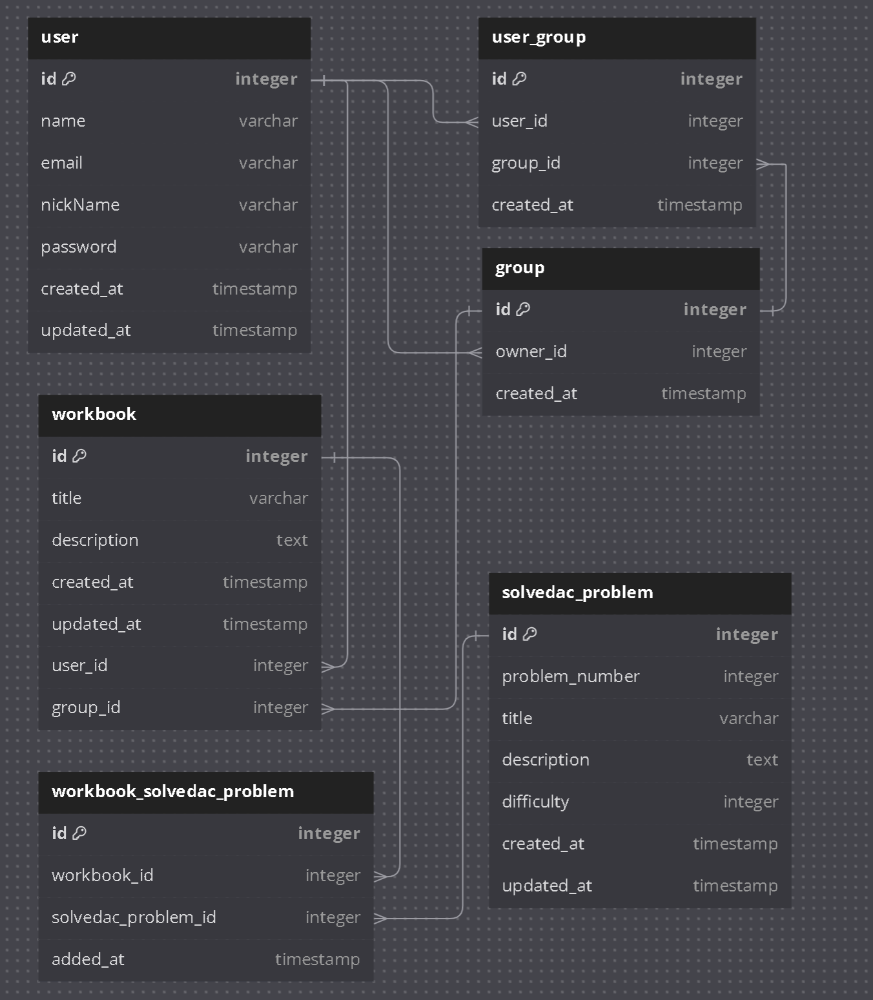

# Algo Memo
## 들어가기에 앞서
백준을 통해서 문제를 함께 풀면서 스터디를 진행 할 수 있는 웹 플랫폼 서비스이다. 백준에 있는 문제를 토대로 문제집을 만들 수 있고, 해당 문제를 푸는 중에 궁금한 부분이 생기면 `질의를 올리며, 이를 해결` 할 수 있다. 또한, 팀 간에 소통 증진을 위해 내부적으로 채팅 기능을 탑재하여, 보다 알고리즘에 대해서 체계적인 스터디를 진행 할 수 있습니다.

## E-R-Diagram 
### 3 정규화 형식

> 추후 성능에 따른 반정규화 고려

## Used Skill
- Internel Used
  - Spring Boot (Required)
  - Spring Jpa (Required)
  - Spring Security (Required)
  - Socket.io (Required)
  - RestClient (Required)
  - LogDash
  - Junit (Required)

- Third-Party
  - Mysql (Required)
  - Redis (Required)
  - ElasticSearch
  - RabbitMQ

## 초기 단계 목표
1. 문제를 풀게 되면 SolvedAC API 통해 풀었는지 여부를 사용자가 직접 동기화
2. JWT 를 통한 인증
3. 게시판을 통해서 정보 공유

## 최종 단계 목표
1. 문제를 풀게 되면 Beakjoon Hub 를 통해 올라가는 데이터를 WebHook으로 파싱해서 처리
2. SolvedAc를 통한 인증 (Custom Oauth)
3. 채팅을 사용해서 실시간 정보 공유

> WebHook 말고도 SSE 방식으로 30분 간격으로 문제를 풀었는지 Batch 작업을 하는 것도 고민중
> 단방향으로 접근하는 것이 맞는 것 같아서 고민중